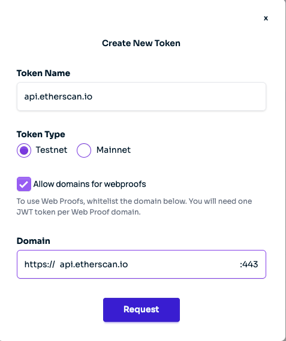

# Server-side Web Proof Generation for Etherscan API Data

This example demonstrates how to use [vlayer Web Proof](https://book.vlayer.xyz/features/web.html) to notarize an HTTP request to:

```
https://api.etherscan.io/v2/api?chainid=1&module=account&action=tokenbalance&contractaddress=${ERC20_CONTRACT_ADDRESS}&address=${WALLET_ADDRESS}&tag=latest&apikey=${ETHERSCAN_API_KEY}
```

It generates a **zero-knowledge proof (ZK proof)** based on the API response, which can then be verified by an **on-chain EVM smart contract**.

Using this guide, you will learn how to deploy vlayer Prover and Verifier contracts to SepoliaOptimism testnet that **prove a user's USDC balance using vlayer web proofs + Etherscan API data.**

## How to Run

1. Clone [example repository](https://github.com/writersblockchain/vlayer-etherscan)

2. Install foundry and bun to run example - see vlayer install guide [here](https://book.vlayer.xyz/getting-started/installation.html)

3. To view the `EtherscanProver.sol` and `EtherscanVerifier.sol` contracts, navigate to [./src/vlayer](./src/vlayer/)

   In `EtherscanProver.sol` we define the API to verify. In this case, an Etherscan API that verifies a user's USDC balance:

   ```solidity
   string public constant URL_PREFIX = "https://api.etherscan.io/v2/api?chainid=1&module=account&action=tokenbalance&contractaddress=0xa0b86991c6218b36c1d19d4a2e9eb0ce3606eb48&address=";
   ```

   If you'd verify a different ERC20 balance, simply update `contractAddress` to your ERC20 contract address.

4. Install dependencies:
   ```
   soldeer install
   ```

5. Compile the contracts:
   ```bash
   forge build
   ```

6. Install Typescript dependencies
   ```bash
   cd vlayer
   bun install
   ```

7. Configure testnet environment
   
   In the [vlayer directory](./vlayer/), create `.env.testnet.local`
   ```bash
   touch .env.testnet.local
   ```
   
   Provide a private key for deploying example contracts and sending transactions to the verifier:
   ```
   EXAMPLES_TEST_PRIVATE_KEY=0x....
   ```
   
   Provide a vlayer API token:
   ```
   VLAYER_API_TOKEN=
   ```
   
   You can generate your Etherscan API token using the [vlayer dashboard](https://dashboard.vlayer.xyz/)
   
   Configure like so:
   
   

## Deploy contracts to sepolia optimism testnet

```bash
VLAYER_ENV=testnet bun run deploy.ts
```

## Execute prover

Navigate to [prove.ts](./vlayer/prove.ts)

Update the `WALLET_ADDRESS` (line 14) to the wallet address you want to verify ERC20 balance for.

Then, execute the prover:
```bash
VLAYER_ENV=testnet bun run prove.ts
```

Upon successful proof generation:

```
✅ Proof generated successfully!
💰 Token Balance: 10966806
⏳ Verifying proof on-chain...
📝 Transaction submitted: 0x7c1f4a017945886e14a7fb99b8316715099859dd1fb10700b5342b909dfc2705
⏳ Waiting for transaction confirmation...
✅ Balance verified and stored on-chain!
🎉 PROOF COMPLETE! Summary:
════════════════════════════════
📄 Token Contract: 0xa0b86991c6218b36c1d19d4a2e9eb0ce3606eb48
👤 Wallet Address: 0x4B808ec5A5d53871e0b7bf53bC2A4Ee89dd1ddB1
💰 Verified Balance: 10966806
🔗 Verifier Contract: 0x88487279d1b9276c113679744cc63531830748cb
📝 Transaction Hash: 0x7c1f4a017945886e14a7fb99b8316715099859dd1fb10700b5342b909dfc2705
```

## 🌐 What Actually Happens Behind the Scenes

1. **vlayer Notary Service:**
   Your request goes to https://test-notary.vlayer.xyz:443
   The notary makes the actual HTTP request to Etherscan

2. **Notary → Etherscan:**
   ```
   GET https://api.etherscan.io/v2/api?chainid=1&module=account&action=tokenbalance&contractaddress=${ERC20_CONTRACT_ADDRESS}&address=${WALLET_ADDRESS}&tag=latest&apikey=${ETHERSCAN_API_KEY}
   ```

3. **Etherscan Responds:**
   ```json
   {
     "status": "1",
     "message": "OK", 
     "result": "10966806"
   }
   ```

4. **Notary Creates Cryptographic Proof:**
   - TLS Certificate verification (proves it really connected to etherscan.io)
   - HTTP request/response recording (proves what was sent/received)
   - Digital signatures (proves data wasn't tampered with)
   - Timestamp (proves when it happened)

5. **Returns Web Proof:**
   The notary sends back JSON with the cryptographic proof.